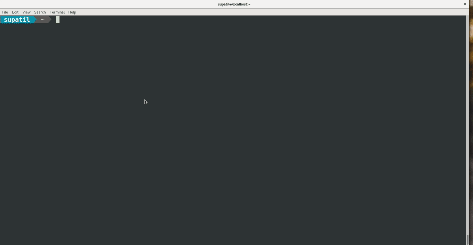

# Connection-manager

Connection-manager is the CLI tool build in Golang for managing ssh connection. It helps in storing the servers ipaddress/hostname, username and password so that we can ssh the system in just one click.

## Installation


For RHEL 7 -

```bash
# subscription-manager repos --enable=rhel-7-server-optional-rpms
# yum install golang  
# go get github.com/patilsuraj767/connection-manager  
```

## Usage

```bash
>> connection-manager --help

Usage:
  connection-manager [flags]
  connection-manager [command]

Available Commands:
  add         Add SSH connection
  delete      Delete SSH connection
  edit        Edit SSH connection
  help        Help about any command

Flags:
  -h, --help   help for connection-manager

Use "connection-manager [command] --help" for more information about a command.

```

## Screen 

#### # connection-manager
connection-manager command will promote the list of servers to which one can ssh. After pressing enter it ssh's the server + server name gets copied to the clipboard 




#### # connection-manager add
Using connection-manager add command we can add our servers in connection-manager


## Contributing
Pull requests are welcome. For major changes, please open an issue first to discuss what you would like to change.